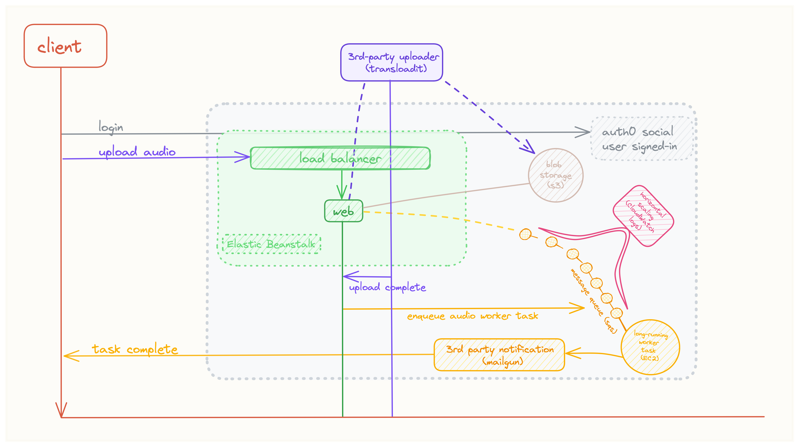

## Purpose

Sample individual audio sources in music.

## Requirements

* Support large file sizes w/ decoupled upload service (transloadit)
* Queue audio for separation w/ worker
* Display queue position or notify user of completion

## System Design

