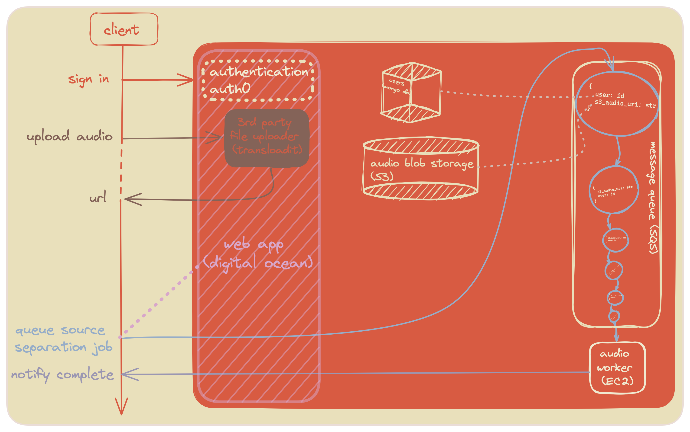

## Purpose
Sample individual audio sources in music.

## Requirements

* Support large file sizes w/ decoupled upload service (transloadit) and source separation service (spleeter on ec2)
* Display queue position while busy, then notify user of completion

## System Design

## Visual Design
### Color Reference

| Color             | Hex                                                                |
| ----------------- | ------------------------------------------------------------------ |
| raisin black |  #272727 |
| pink lavender |  #d8a7ca |
| dutch white |  #e9e0bb |
| jasper |  #d85b42 |
| powder blue |  #96adc8 |